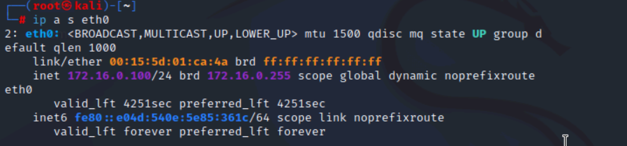

# Lab Write-Up: Threat Hunting and Indicators of Compromise

In this lab, I will perform threat hunting activities and track indicators of compromise (IoCs) within the internal network of **Structureality Inc.** As a cybersecurity analyst, my goal is to identify vulnerabilities, unusual activity, and potential threats that could compromise the organization’s systems.

The lab is structured to provide hands-on experience with multiple security tools and techniques. I will begin by analyzing **firewall logs** to detect questionable network traffic. Next, I will use **netstat** to identify IoCs related to traffic abuse targeting a secure website. Following that, I will perform focused threat-hunting exercises across several virtual machines to investigate suspicious behavior. Finally, I will analyze unusual **DNS activity** to uncover additional IoCs that may indicate malicious activity.

Throughout this lab, I will apply core **CompTIA CySA+ objectives**, including:

- Analyzing indicators of potentially malicious activity  
- Using appropriate tools to investigate threats  
- Comparing threat intelligence and threat-hunting concepts  
- Performing incident response activities  

This lab will reinforce my understanding of proactive threat detection and the methods used to secure an enterprise network environment.

# Lab Activity: Enabling Logging, Generating Traffic, and Inspecting Tools

## What I did
I connected to the **LAMP** VM and signed in as `lamp` (password `Pa$$w0rd`). I elevated to root privileges with:

```bash
sudo su
# enter Pa$$w0rd when prompted

# enter command for iptables
iptables -A INPUT -j LOG
```

I exported the current iptables rules to a readable file (the lab verification script cannot read the rules directly)

```bash
iptables -S > /home/lamp/filter-list.txt

# shows the last 10 lines and follows new entries
```

tail -f /var/log/kern.log
I then started live monitoring of the kernel log so I could observe events as they occurred:

I left the tail -f running to capture log activity.

Next, I connected to KALI VM as root (Pa$$w0rd), and opened the terminal

```bash
vim ./lab04demo1.sh
```
I seen it was a .sh file meaning that it was a script so got curious and opened the file to read it

```bash
nmap 172.16.0.201 -p 1-100 -r -T2 >/dev/null
```
I seen that it was a nmap with some research in the man page i found out it was checking ports 1 through 100 -r for do not randomize order of ports scanned -T2 for the timing template then piping the result to /dev/null

Then I ran the script and waited for the terminal prompt to reappear

Entered to check the ip on eth0 interface
```bash
ip a s eth0
```

