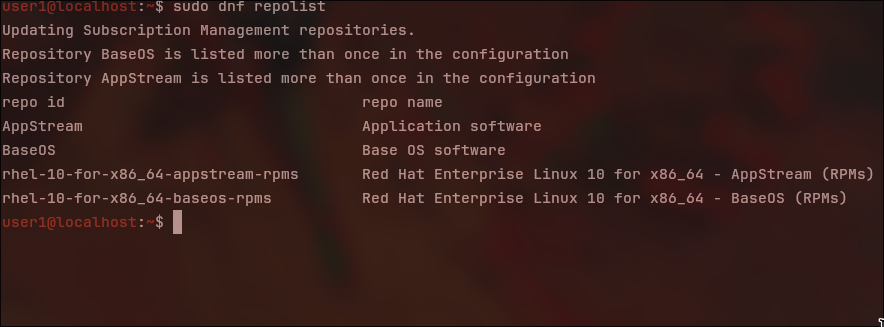
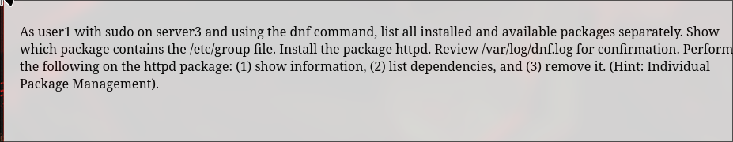
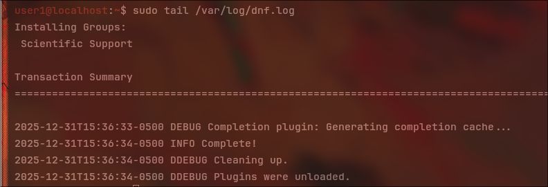

# Lab 10-1: Configure Access to RHEL 9 Repositories


Check to see if RHEL 9 image is attached and mounted
```bash
lsblk
ls -la /mnt
```

Create the definition file
```bash
sudo vi /etc/yum.repos.d/local2.repo
```

```bash
sudo dnf clean all
```
Then view the repolist
```bash
sudo dnf repolist
```


---
# Lab  10-2: Install and Manage Individual Packages


To List all installed and available packages 
```bash
dnf list --installed
dnf list --available 
```

Show which packages contains the /etc/group files
```bash
dnf provides /etc/group
```

Install the package httpd
```bash
sudo dnf install httpd
```


Show info of httpd
```bash
dnf info httpd
```
List dependences
```bash
dnf deplist httpd
```

Remove it
```bash
sudo dnf remove httpd -y
```

---
# Lab 10-3: Install and Manage Package  Groups
List availble and installed package groups seperate

```bash
dnf group list available
dnf group list installed
```

Install package groups Security Tools and Scientific Support
```bash
sudo dnf group install "scientific support"
sudo dnf group install "security tools"
```

```bash
sudo tail /var/log/dnf.log
```


Show info for scientific support package
```bash
dnf group info "Scientific Support"
```

Remove scientific support package
```bash
sudo dnf group remove "scientific support"
```
