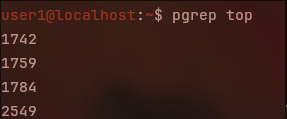
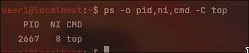
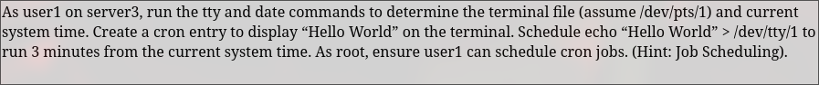
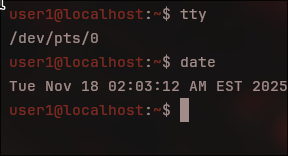
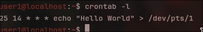

# Lab 8-1 : Nice and Renice a Process

So to start run this command on the first server
```bash
top
```
After switch to the second terminal and run this

```bash
pgrep top
```
It returns this result


Then stop top in the first terminal
```bash
nice -n 8 top
```



Then to renice the command run 
```bash
sudo renice -10 2667
```


# Lab 8-2 Configure a User Crontab File



to start run tty and date
```bash
tty
date
```



then we make the crontab
```bash
crontab -e

```

Enter this in


you can then exit then confirm
