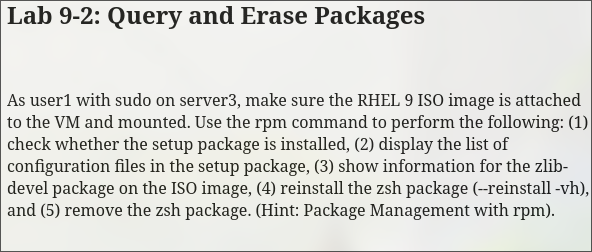
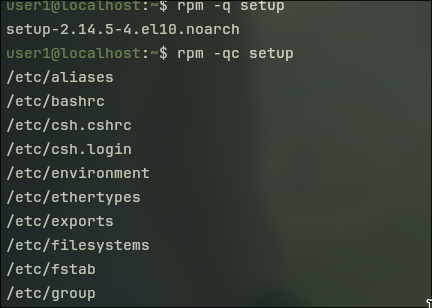

```bash
sudo rpm /mnt/BaseOs/Packages/zsh*.rpm
```

```bash
rpm -qi zsh
```


```bash
rpm -K /mnt/BaseOs/Packages/zsh*.rpm
```


```bash
rpm -V zsh
```

---


```bash
rpm -q setup
```

```bash
rpm -qc setup
```



```bash
rpm -qip /mnt/BaseOs/Packages/zlib-devel-*.rpm
```

```bash
sudo rpm --reinstall -vh zsh
```

```bash
sudo rpm -e zsh
```
